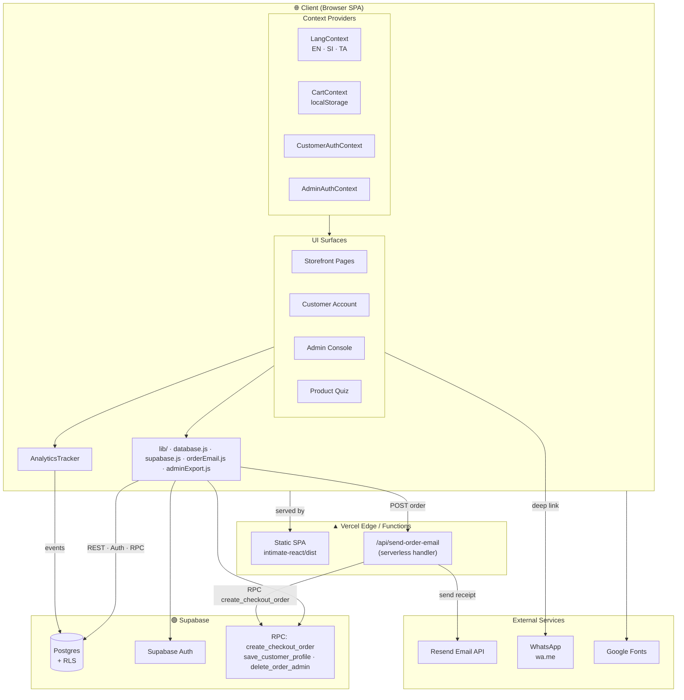
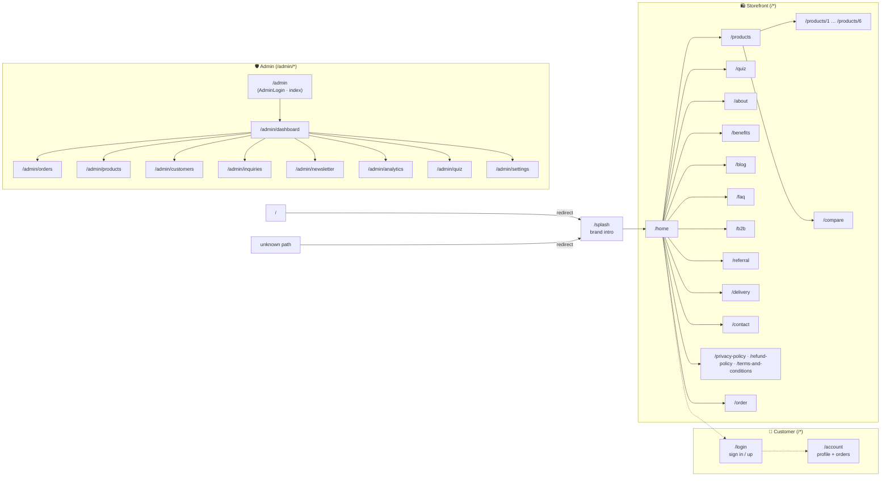
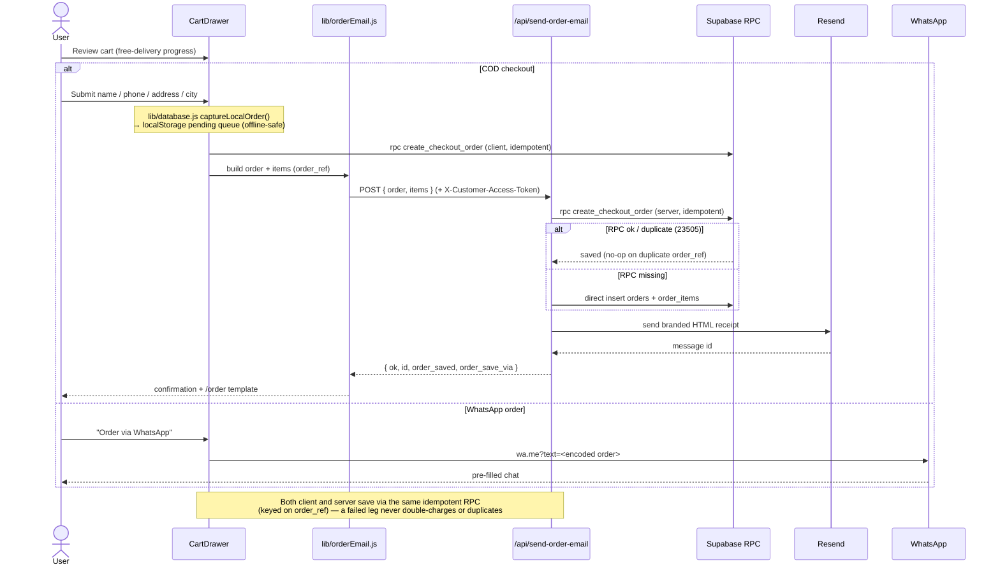
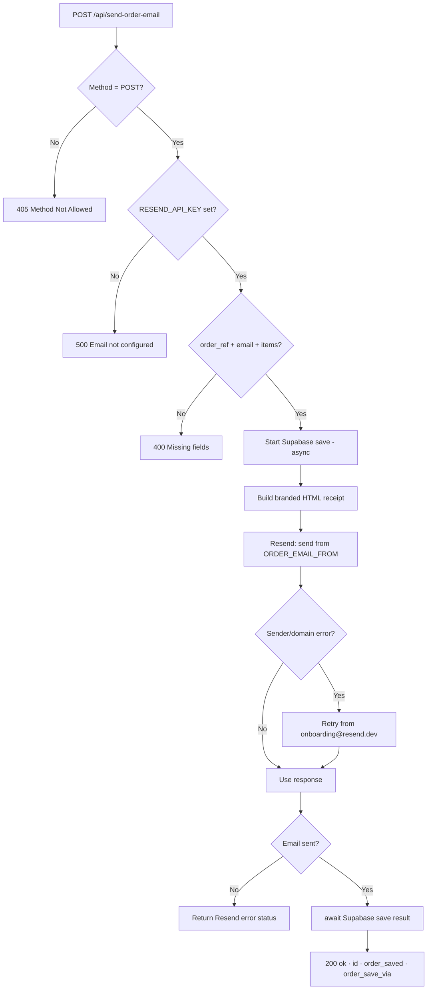
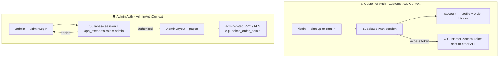
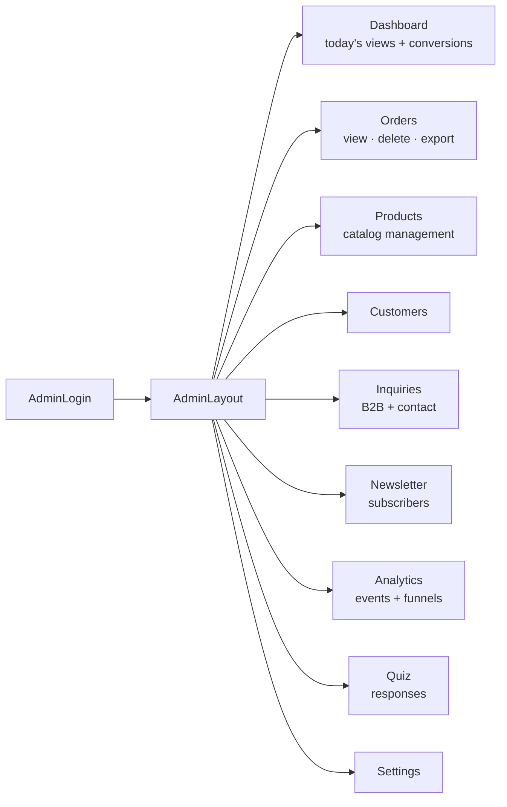
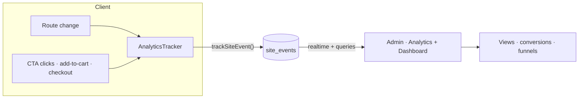
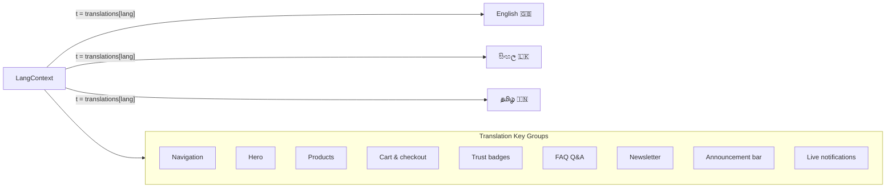
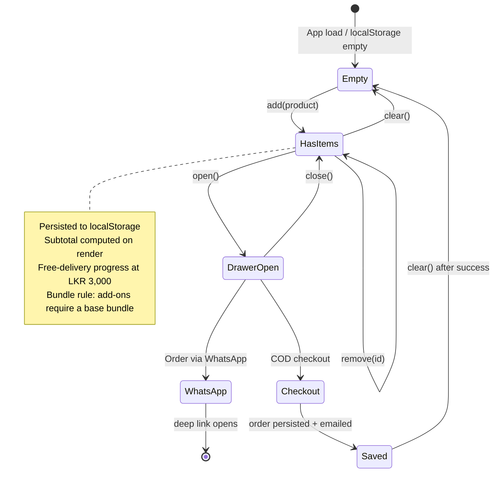

<div align="center">


<br/>

# Hygenc Covers — Intimate Hygiene E-Commerce Platform

**Premium toilet seat cover products for Sri Lanka — built for retail, hospitality & B2B**

<br/>

[](https://react.dev)
[](https://vitejs.dev)
[](https://tailwindcss.com)
[](https://reactrouter.com)
[](https://supabase.com)
[](https://resend.com)
[](https://vercel.com)

[](LICENSE)
[](https://nodejs.org)
[](https://wa.me/94729991950)

</div>

---

## Table of Contents

- [Overview](#overview)
- [What's New](#whats-new)
- [Tech Stack](#tech-stack)
- [System Architecture](#system-architecture)
- [Module Map](#module-map)
- [Routing](#routing)
- [Data Model](#data-model)
- [Checkout & Order Lifecycle](#checkout--order-lifecycle)
- [Order Email Pipeline](#order-email-pipeline)
- [Authentication](#authentication)
- [Admin Panel](#admin-panel)
- [Analytics & Tracking](#analytics--tracking)
- [Internationalisation (i18n)](#internationalisation-i18n)
- [Cart State Management](#cart-state-management)
- [Features](#features)
- [Project Structure](#project-structure)
- [Getting Started](#getting-started)
- [Environment & Configuration](#environment--configuration)
- [Deployment](#deployment)
- [Scripts](#scripts)
- [Contributing](#contributing)

---

## Overview

**Hygenc Covers** is a high-conversion, mobile-first e-commerce platform for **intimate hygiene toilet seat covers** targeting the Sri Lankan market. It began as a client-only WhatsApp storefront and has grown into a **full-stack application** with a Supabase backend, a serverless order-email API, customer accounts, and a complete admin console.

The platform serves three customer segments:

| Segment | Product | Channel |
|---|---|---|
| Retail / Personal | Single Use Pack | Cart · COD checkout · WhatsApp |
| Travellers | Travel Pack (Waterproof) | Cart · COD checkout · WhatsApp |
| Hotels / Corporates | Enterprise Bulk Pack | B2B Enquiry Form |

The storefront is fully internationalised across **English**, **Sinhala (සිංහල)**, and **Tamil (தமிழ்)**. Customers can check out three ways: a **cash-on-delivery (COD) order** persisted to Supabase with an emailed confirmation, a **WhatsApp deep-link** order, or a **B2B enquiry** for bulk buyers.

---

## What's New

The platform has expanded well beyond the original WhatsApp-only storefront. Recent additions:

- 🛒 **COD checkout + order persistence** — orders saved to Supabase via a `create_checkout_order` RPC with an idempotent, offline-tolerant fallback path.
- 📧 **Transactional order emails** — a serverless function renders a branded HTML receipt and sends it through **Resend** (with a verified-sender fallback).
- 🔐 **Customer accounts** — sign-up / sign-in, profile, and order history backed by Supabase Auth.
- 🛡️ **Admin console** — dashboard, orders, products, customers, inquiries, newsletter, analytics, quiz, and settings, behind an admin auth guard.
- 📊 **Analytics & tracking** — page views, conversions, and custom events stored in Supabase and surfaced in the admin analytics page.
- 🧪 **Product finder quiz** — guided recommendation flow with responses stored for insight.
- 🗂️ **Product catalog & bundles** — a data-driven catalog (6 products) with bundle rules (add-ons require a base bundle).
- 📄 **Policy pages** — privacy, terms, refund, and shipping policy pages wired into the footer.
- 📤 **Admin export** — orders/customers exportable to CSV/HTML.
- 🔎 **SEO** — per-page metadata via a reusable `SEO` component.

---

## Tech Stack

| Layer | Technology |
|---|---|
| **UI Framework** | React 19 |
| **Build Tool** | Vite 8 |
| **Styling** | Tailwind CSS 4 (`@tailwindcss/vite` JIT) |
| **Routing** | React Router DOM 7 |
| **Icons** | Font Awesome 7 (SVG Core) + Lucide React |
| **Animation** | Framer Motion + CSS keyframes / IntersectionObserver |
| **Charts** | Recharts (admin analytics) |
| **Dates** | date-fns |
| **Client State** | React Context API (Cart · Lang · CustomerAuth · AdminAuth) |
| **Backend (BaaS)** | Supabase — Postgres, Auth, Row-Level Security, RPC functions |
| **Serverless API** | Vercel Functions (`/api/*`, Node handler) |
| **Transactional Email** | Resend (production) · Nodemailer (local tooling) |
| **Hosting / CI-CD** | Vercel (static SPA + serverless functions) |
| **Checkout Channels** | COD form · WhatsApp deep link (`wa.me`) · B2B enquiry |
| **Browser Persistence** | localStorage / sessionStorage |
| **Linting** | ESLint + react-hooks + react-refresh |

---

## System Architecture



---

## Module Map

```mermaid
graph TD
    main[main.jsx] --> App

    App --> Ctx[Context Providers]
    App --> GlobalUI[Global UI Layer]
    App --> Router[React Router]
    App --> Track[AnalyticsTracker]

    Ctx --> Lang[LangContext]
    Ctx --> Cart[CartContext]
    Ctx --> CustAuth[CustomerAuthContext]
    Ctx --> AdminAuth[AdminAuthContext]

    GlobalUI --> AnnouncementBar
    GlobalUI --> WhatsAppButton
    GlobalUI --> DiscountPopup
    GlobalUI --> LivePurchaseNotification
    GlobalUI --> CartDrawer
    GlobalUI --> StickyMobileCTA
    GlobalUI --> SEO
    GlobalUI --> ScrollToTop

    Router --> Storefront
    Router --> Customer
    Router --> AdminRouter

    Storefront --> Home & Products & ProductDetail[Product1..6] & Compare
    Storefront --> About & Benefits & Blog & FAQ & B2B & Referral
    Storefront --> Delivery & Contact & Quiz & PolicyPages & OrderTemplate

    Customer --> CustomerAuth & CustomerAccount

    AdminRouter --> AdminLogin
    AdminRouter --> AdminLayout
    AdminLayout --> AdminDashboard & AdminOrders & AdminProducts & AdminCustomers
    AdminLayout --> AdminInquiries & AdminNewsletter & AdminAnalytics & AdminQuiz & AdminSettings

    ProductDetail --> Catalog[data/catalog.js]
    ProductDetail --> ProductContent[data/productContent.js]
    AdminOrders --> adminExport[lib/adminExport.js]
    CartDrawer --> orderEmail[lib/orderEmail.js]
    orderEmail --> API["/api/send-order-email"]
    AdminDashboard --> database[lib/database.js]
    database --> supabase[lib/supabase.js]
```



---

## Routing

The app splits at the top level into an **admin tree** (`/admin/*`, fully isolated — no storefront overlays) and the **customer tree** (`/*`). Source of truth: [App.jsx](intimate-react/src/App.jsx).



---

## Data Model

Eight tables back the platform. `customer_profiles` and `orders.customer_id` reference Supabase's `auth.users`. The authoritative schema (columns, RLS policies, RPCs, seed data) lives in [supabase-schema.sql](supabase-schema.sql).

```mermaid
erDiagram
    AUTH_USERS ||--o| CUSTOMER_PROFILES : "has profile"
    AUTH_USERS ||--o{ ORDERS : "places (optional)"
    ORDERS ||--|{ ORDER_ITEMS : contains
    PRODUCTS ||--o{ ORDER_ITEMS : "referenced by"

    AUTH_USERS {
        uuid id PK
        text email
        jsonb app_metadata "role=admin gate"
    }
    CUSTOMER_PROFILES {
        uuid id PK_FK
        text email
        text name
        text phone
        text address
        text city
        text preferred_payment_method
    }
    ORDERS {
        uuid id PK
        uuid customer_id FK "nullable"
        text order_ref UK
        text customer_name
        text customer_email
        text customer_phone
        text address
        text city
        numeric total
        text status
        text payment_method
        text discount_code
        text note
        timestamptz created_at
    }
    ORDER_ITEMS {
        uuid id PK
        uuid order_id FK
        uuid product_id FK "nullable"
        text product_name
        int quantity
        numeric price
    }
    PRODUCTS {
        uuid id PK
        text slug UK
        text name
        numeric price
        numeric cost
        int stock
        int sold
        numeric rating
        text category
        bool active
    }
    INQUIRIES {
        uuid id PK
        text company
        text name
        text email
        text message
        text status
    }
    NEWSLETTER_SUBSCRIBERS {
        uuid id PK
        text email UK
        bool active
    }
    QUIZ_RESPONSES {
        uuid id PK
        text name
        text phone
        jsonb answers
        text result
        int score
    }
    SITE_EVENTS {
        uuid id PK
        text event_type
        text path
        text label
        jsonb metadata
        timestamptz created_at
    }
```

> **RLS, RPC & Realtime:**
> - All eight tables enable **Row-Level Security**. Public can `insert` orders, inquiries, newsletter, quiz, and site events; reads of sensitive data require the `admin` role (checked via `auth.jwt() -> 'app_metadata' ->> 'role'`). Customers can read only their own profile and orders.
> - SECURITY DEFINER RPCs: **`create_checkout_order`** (atomic order + items insert, idempotent on `order_ref`), **`save_customer_profile`** (upsert), and **`delete_order_admin`** (admin-gated cascade delete).
> - Tables are added to the `supabase_realtime` publication, so the admin dashboard and product feed update **live** via `postgres_changes` subscriptions.

---

## Checkout & Order Lifecycle



---

## Order Email Pipeline



Server-side environment knobs: `ORDER_EMAIL_FROM`, `ORDER_EMAIL_REPLY_TO`, `ORDER_EMAIL_BCC`, plus `SITE_URL` / `VERCEL_URL` for the logo base URL.

---

## Authentication

Two independent auth contexts, both backed by Supabase Auth, guard their respective areas.



---

## Admin Panel

A protected console (`/admin/*`) for operating the store. Wrapped by `AdminLayout` and guarded by `AdminAuthContext`.



| Page | Purpose |
|---|---|
| **Dashboard** | KPIs — today's page views, conversions, recent orders |
| **Orders** | List, inspect, delete (admin-checked RPC), CSV/HTML export |
| **Products** | Manage the product catalog |
| **Customers** | Registered customer accounts |
| **Inquiries** | B2B + contact-form submissions |
| **Newsletter** | Email subscribers |
| **Analytics** | Event stream, page views, conversion insight |
| **Quiz** | Product-finder quiz responses |
| **Settings** | Store configuration |

---

## Analytics & Tracking



`AnalyticsTracker` records page views on navigation and custom conversion events via `trackSiteEvent()` ([lib/database.js](intimate-react/src/lib/database.js)), writing to the `site_events` table (`event_type`, `path`, `label`, `metadata`). The admin dashboard aggregates today's views and conversions, updating live through realtime subscriptions.

---

## Internationalisation (i18n)



Language is toggled via `LangToggle` in the Navbar. English is the default audience language.

---

## Cart State Management



---

## Features

### Customer-Facing
| Feature | Description |
|---|---|
| **Splash & Premium Hero** | Animated brand intro, gradient/blob hero, trust chips, hero stats |
| **Product Catalog (×6)** | Data-driven catalog with bundles; add-ons require a base bundle |
| **COD Checkout** | Order form → Supabase persistence → emailed receipt |
| **WhatsApp Checkout** | Pre-filled order deep link, zero payment infra |
| **Product Quiz** | Guided product-finder with stored responses |
| **Customer Accounts** | Sign-up/in, profile, order history (Supabase Auth) |
| **Live Purchase Notifications** | Cycling social-proof toasts |
| **Announcement Bar** | 24h countdown, dismissible, gradient shimmer |
| **Before/After Slider** | Drag/touch hygiene-contrast reveal |
| **Scroll Reveals & CountUp** | IntersectionObserver animations + animated stats |
| **Cart Drawer** | Qty controls, free-delivery progress, dual checkout |
| **Sticky Mobile CTA** | Shop + WhatsApp bar after scroll |
| **Discount Popup & Newsletter** | Timed offer + email capture |
| **FAQ Accordion** | Pure-CSS grid-rows animation |
| **B2B & Referral** | Bulk enquiry + referral entry points |
| **Policy Pages** | Privacy / terms / refund / shipping |
| **SEO** | Per-page metadata via `SEO` component |

### Backend & Operations
| Feature | Description |
|---|---|
| **Order Persistence** | `create_checkout_order` RPC with idempotent + direct-insert fallback |
| **Transactional Email** | Branded HTML receipts via Resend with sender fallback |
| **Admin Console** | Full CRUD/insight surface behind admin auth |
| **Realtime** | Admin dashboard + product feed update live via `postgres_changes` |
| **Offline-safe orders** | Local pending-order queue with idempotent cloud sync |
| **Analytics** | Page views, conversions, custom events in `site_events` |
| **Export** | Orders/customers → CSV/HTML |
| **RLS & RPC** | Least-privilege client; admin-checked destructive ops |

### Developer Experience
| Feature | Description |
|---|---|
| **Vite HMR** | Sub-100ms hot module replacement |
| **Tailwind v4** | Zero-config JIT via `@tailwindcss/vite` |
| **Custom animations** | 12+ keyframes; `prefers-reduced-motion` honoured |
| **Graceful degradation** | App runs even when Supabase/Resend env vars are absent |
| **ESLint** | react-hooks + react-refresh rules |

---

## Project Structure

```
INTIMATE_HYGIENE/
├── api/
│   └── send-order-email.js        # Vercel serverless: save order (RPC) + Resend receipt
├── supabase/
│   └── email-templates/           # Supabase auth email templates
├── supabase-schema.sql            # Authoritative DB schema (tables, RLS, RPC)
├── vercel.json                    # Build + SPA rewrite + serverless config
├── package.json                   # Root scripts & backend deps (supabase-js, resend, nodemailer)
│
└── intimate-react/                # Frontend SPA
    ├── public/                    # Logos, favicons, product images
    ├── index.html
    ├── vite.config.js             # Vite + Tailwind + dev API middleware
    ├── eslint.config.js
    └── src/
        ├── main.jsx               # Entry — mounts <App/>
        ├── App.jsx                # Providers + global UI + router
        ├── index.css              # Global styles & keyframes
        │
        ├── context/
        │   ├── LangContext.jsx           # EN/SI/TA translations
        │   ├── CartContext.jsx           # Cart state + bundle rules
        │   ├── CustomerAuthContext.jsx   # Customer Supabase Auth
        │   └── AdminAuthContext.jsx      # Admin auth + guard
        │
        ├── lib/
        │   ├── supabase.js               # Supabase client (env-guarded)
        │   ├── database.js               # Data access (orders, analytics, etc.)
        │   ├── orderEmail.js             # Client → /api/send-order-email
        │   └── adminExport.js            # CSV/HTML export helpers
        │
        ├── data/
        │   ├── catalog.js                # Product catalog + bundle definitions
        │   └── productContent.js         # Per-product marketing content
        │
        ├── hooks/
        │   └── useInView.js              # IntersectionObserver hook
        │
        ├── components/                   # Navbar, Footer, CartDrawer, SEO,
        │   │                             # AnalyticsTracker, TrustBadges, Reveal,
        │   │                             # BeforeAfterSlider, CountUp, LangToggle, …
        │   └── ...
        │
        ├── pages/
        │   ├── Splash · Home · Products · Product1..6 · Compare
        │   ├── About · Benefits · Blog · FAQ · B2B · Referral · Delivery · Contact
        │   ├── Quiz · PolicyPages · OrderTemplate
        │   └── CustomerAuth · CustomerAccount
        │
        └── admin/
            ├── AdminLayout.jsx · AdminLogin.jsx
            └── pages/
                ├── AdminDashboard · AdminOrders · AdminProducts · AdminCustomers
                ├── AdminInquiries · AdminNewsletter · AdminAnalytics
                └── AdminQuiz · AdminSettings
```

---

## Getting Started

### Prerequisites
- Node.js ≥ 18
- npm ≥ 9
- (Optional for full backend) A Supabase project + a Resend API key

### Installation

```bash
git clone https://github.com/your-org/INTIMATE_HYGIENE.git
cd INTIMATE_HYGIENE/intimate-react
npm install
```

### Development

```bash
# From intimate-react/
npm run dev
# → http://localhost:5173/
```

Vite mounts the **order-email API in dev** via a custom middleware plugin (`orderEmailDevApi` in [vite.config.js](intimate-react/vite.config.js)) that runs the very same [api/send-order-email.js](api/send-order-email.js) handler used in production — so `POST /api/send-order-email` works locally with no separate server process.

> The frontend runs even **without** Supabase/Resend configured — `lib/supabase.js` is env-guarded (`isSupabaseConfigured`) and the app degrades gracefully: orders fall back to a local pending queue + WhatsApp, and analytics/admin features stay dormant. Configure the env vars below to enable the full stack.

### Production Build

```bash
# From intimate-react/
npm run build        # → intimate-react/dist
npm run preview      # serve the production build locally
```

---

## Environment & Configuration

Create a `.env.local` at the repo root (server/serverless) and the matching `VITE_`-prefixed values for the client.

### Client (`intimate-react`, exposed to the browser)
| Variable | Purpose |
|---|---|
| `VITE_SUPABASE_URL` | Supabase project URL |
| `VITE_SUPABASE_PUBLISHABLE_KEY` | Supabase anon/publishable key |
| `VITE_ORDER_EMAIL_API_URL` | *(optional)* base URL for the order-email API (defaults to same origin) |

### Serverless / API (`/api/send-order-email`)
| Variable | Purpose |
|---|---|
| `RESEND_API_KEY` | **Required** — Resend API key for sending receipts |
| `SUPABASE_URL` *(or `VITE_SUPABASE_URL`)* | Supabase URL for server-side order save |
| `SUPABASE_SERVICE_ROLE_KEY` *(or anon/publishable)* | Key used by the function for RPC/insert |
| `ORDER_EMAIL_FROM` | Verified sender (falls back to `onboarding@resend.dev`) |
| `ORDER_EMAIL_REPLY_TO` | Reply-to address |
| `ORDER_EMAIL_BCC` | BCC for internal order copies |
| `SITE_URL` / `VERCEL_URL` | Base URL used for the email logo |

### Storefront constants (in code)
| Setting | Location |
|---|---|
| WhatsApp number | `whatsappMsg` strings + `CartDrawer.jsx` / `WhatsAppButton.jsx` / `StickyMobileCTA.jsx` |
| Free-delivery threshold (LKR 3,000) | `DeliveryProgressBar.jsx` / `CartDrawer.jsx` |
| Product catalog & bundles | `src/data/catalog.js` |

---

## Deployment

```mermaid
flowchart LR
    Dev[git push main] --> Vercel
    subgraph Vercel["▲ Vercel"]
        Build["buildCommand:<br/>cd intimate-react && npm install && npm run build"]
        Build --> Static[Static SPA<br/>intimate-react/dist]
        Func[Serverless<br/>/api/send-order-email]
    end
    Static -->|rewrite /(.*) → /index.html| Client[Browser]
    Client --> Func
    Func --> SB[(Supabase)]
    Func --> RS[Resend]
```

Deployment is driven by [vercel.json](vercel.json):

```json
{
  "buildCommand": "cd intimate-react && npm install && npm run build",
  "outputDirectory": "intimate-react/dist",
  "rewrites": [
    { "source": "/(.*)", "destination": "/index.html" }
  ]
}
```

- Files in `api/` are deployed as **Vercel serverless functions** (`/api/send-order-email`).
- The SPA rewrite ensures client-side routes (e.g. `/admin/orders`, `/products/3`) resolve on refresh/direct visit.
- Set all environment variables in the Vercel project settings.
- Run [supabase-schema.sql](supabase-schema.sql) against your Supabase project to provision tables, RLS, and RPCs.

---

## Scripts

All scripts run from `intimate-react/`:

| Script | Description |
|---|---|
| `npm run dev` | Vite dev server + dev order-email API, HMR (`:5173`) |
| `npm run build` | Production bundle → `dist/` |
| `npm run preview` | Serve the production build locally |
| `npm run lint` | Run ESLint |

---

## Contributing

1. Fork the repository
2. Create a feature branch: `git checkout -b feat/your-feature`
3. Commit using conventional commits: `git commit -m "feat: add X"`
4. Push: `git push origin feat/your-feature`
5. Open a Pull Request against `main`

---

<div align="center">

**Hygenc Covers** · Made with ❤️ for Sri Lanka

[WhatsApp](https://wa.me/94729991950) · Intimate Hygiene Enterprises

</div>
