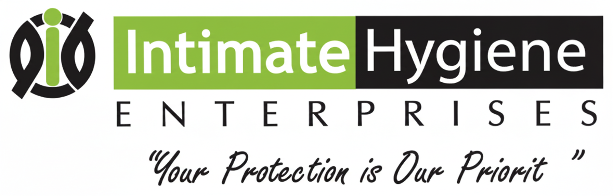
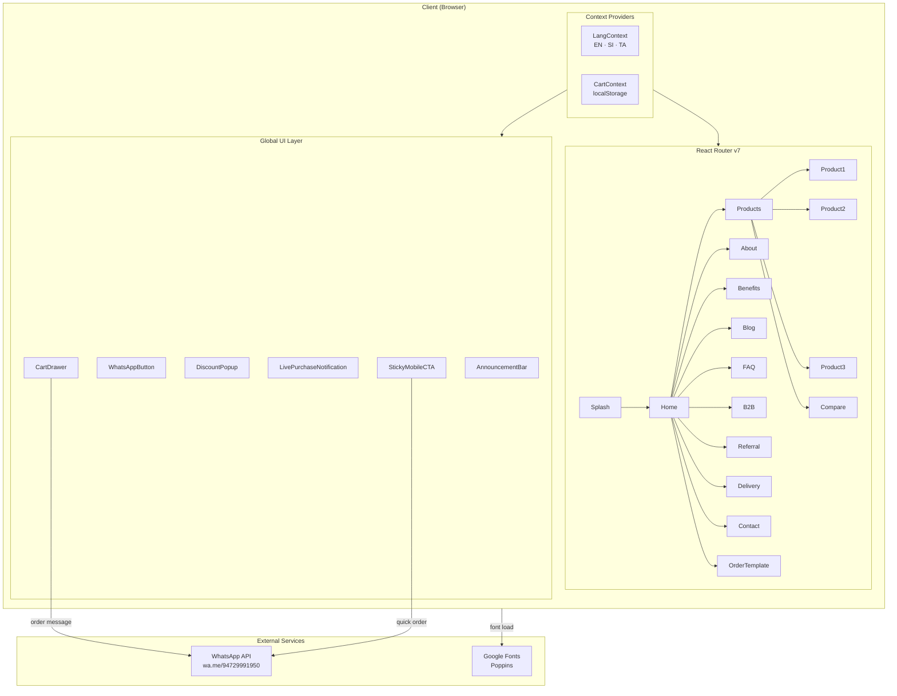
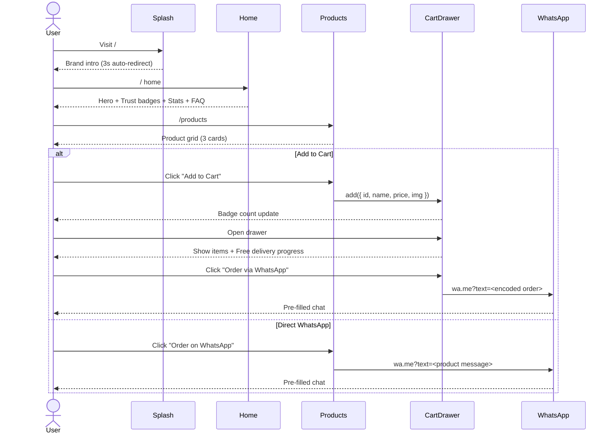
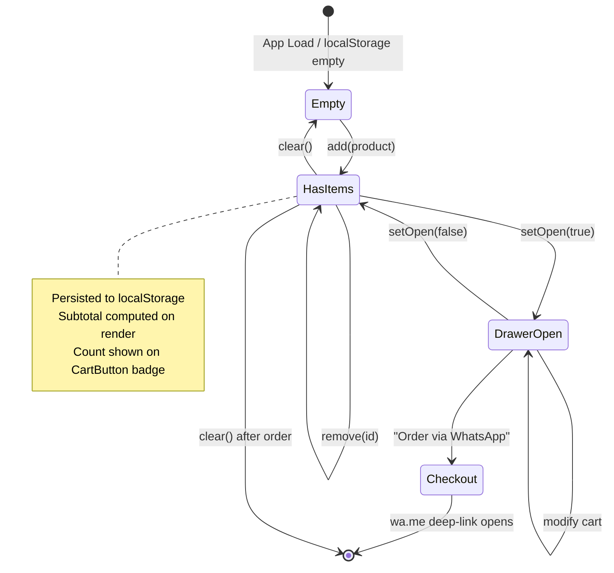
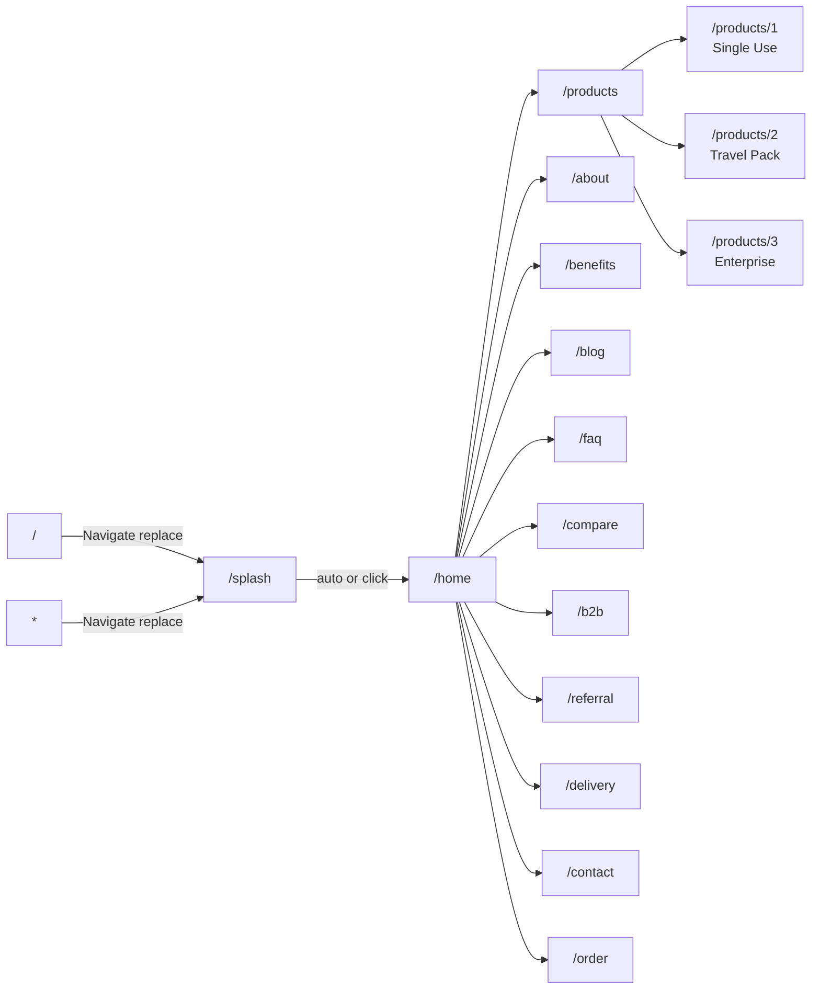
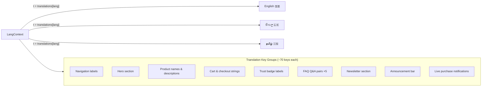
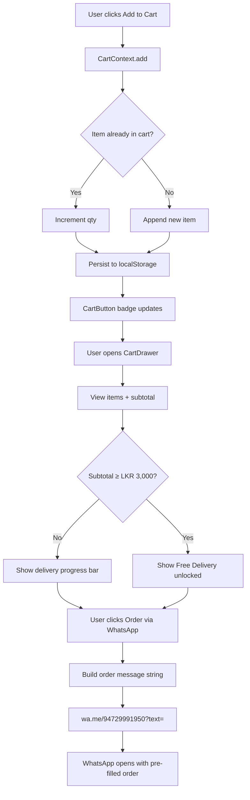

<div align="center">



<br/>

# Hygenc Covers — Intimate Hygiene E-Commerce Platform

**Premium toilet seat cover products for Sri Lanka — built for retail, hospitality & B2B**

<br/>

[](https://react.dev)
[](https://vitejs.dev)
[](https://tailwindcss.com)
[](https://reactrouter.com)
[](https://fontawesome.com)

[](LICENSE)
[](https://nodejs.org)
[](https://wa.me/94729991950)

</div>

---

## Table of Contents

- [Overview](#overview)
- [Tech Stack](#tech-stack)
- [Architecture](#architecture)
- [Application Flow](#application-flow)
- [Component Tree](#component-tree)
- [State Management](#state-management)
- [Routing](#routing)
- [Internationalisation (i18n)](#internationalisation-i18n)
- [Cart & Checkout Flow](#cart--checkout-flow)
- [Features](#features)
- [Project Structure](#project-structure)
- [Getting Started](#getting-started)
- [Scripts](#scripts)
- [Environment & Configuration](#environment--configuration)
- [Contributing](#contributing)

---

## Overview

**Hygenc Covers** is a high-conversion, mobile-first e-commerce web application for **intimate hygiene toilet seat covers** targeting the Sri Lankan market. The platform supports three customer segments:

| Segment | Product | Channel |
|---|---|---|
| Retail / Personal | Single Use Pack | WhatsApp · Cart |
| Travellers | Travel Pack (Waterproof) | WhatsApp · Cart |
| Hotels / Corporates | Enterprise Bulk Pack | B2B Enquiry Form |

The storefront is fully internationalised across **English**, **Sinhala (සිංහල)**, and **Tamil (தமிழ்)**, with a WhatsApp-first checkout that requires zero backend payment infrastructure.

---

## Tech Stack

| Layer | Technology | Version |
|---|---|---|
| UI Framework | React | 19 |
| Build Tool | Vite | 8 |
| Styling | Tailwind CSS | 4 |
| Routing | React Router DOM | 7 |
| Icons | Font Awesome (SVG Core) | 7 |
| Animation | CSS Keyframes + IntersectionObserver | — |
| State | React Context API | — |
| Persistence | localStorage / sessionStorage | Browser native |
| Checkout | WhatsApp Deep Link | `wa.me` protocol |
| Font | Google Fonts — Poppins | 400/600/700/900 |
| Linter | ESLint + react-hooks + react-refresh | 10 |

---

## Architecture



---

## Application Flow



---

## Component Tree

```mermaid
graph TD
    App --> LangProvider
    App --> CartProvider
    App --> BrowserRouter

    BrowserRouter --> GlobalUI
    GlobalUI --> AnnouncementBar
    GlobalUI --> WhatsAppButton
    GlobalUI --> DiscountPopup
    GlobalUI --> LivePurchaseNotification
    GlobalUI --> CartDrawer
    GlobalUI --> StickyMobileCTA

    BrowserRouter --> Routes

    Routes --> Splash
    Routes --> Home
    Routes --> Products
    Routes --> Product1 & Product2 & Product3
    Routes --> About & Benefits & Blog
    Routes --> FAQ & Compare & B2B
    Routes --> Referral & Delivery & Contact
    Routes --> OrderTemplate

    Home --> Navbar
    Home --> HeroSection
    Home --> TrustBadges
    Home --> CountUp
    Home --> BeforeAfterSlider
    Home --> FAQAccordion
    Home --> NewsletterSignup
    Home --> Footer
    Home --> ScrollToTop

    Products --> Navbar
    Products --> TrustBadges
    Products --> DeliveryProgressBar
    Products --> ProductCards["Product Cards (×3)"]
    Products --> Footer

    CartDrawer --> DeliveryProgressBar
    CartDrawer --> CartItems["Cart Items"]
    CartDrawer --> WhatsAppCheckout["WhatsApp Checkout CTA"]
```



---

## State Management



---

## Routing



---

## Internationalisation (i18n)



The active language is toggled via `LangToggle` component in the Navbar and persisted in React state (resets on reload — no localStorage persistence by design so the default audience sees English).

---

## Cart & Checkout Flow



---

## Features

### Customer-Facing
| Feature | Description |
|---|---|
| **Splash Screen** | Animated brand intro with auto-redirect |
| **Premium Hero** | Gradient + blob animations + trust chip + hero stats |
| **Live Purchase Notifications** | Cycling toast — real names, cities, products (sessionStorage once-per-session) |
| **Announcement Bar** | Live 24h countdown timer, dismissible, gradient shimmer |
| **Before/After Slider** | Interactive drag + touch slider showing hygiene contrast |
| **Scroll-triggered Reveals** | `up`, `left`, `right`, `zoom` variants via IntersectionObserver |
| **CountUp Animations** | Animated stats (10,000+ customers, 4.9★, etc.) |
| **Product Cards** | Image badges, urgency chips, star ratings, add-to-cart |
| **Cart Drawer** | Slide-in, qty controls, free delivery progress, WhatsApp checkout |
| **Sticky Mobile CTA** | Bottom bar with Shop + WhatsApp, visible after 400px scroll |
| **Discount Popup** | Timed offer popup, sessionStorage dismissed |
| **FAQ Accordion** | CSS grid-rows animation, no JS height measurement |
| **Newsletter Signup** | Email capture, localStorage, success animation, 5% off badge |
| **B2B Page** | Bulk enquiry channel for hotels/corporates |
| **Referral Page** | Referral programme entry point |
| **Product Comparison** | Side-by-side table of all three packs |

### Developer Experience
| Feature | Description |
|---|---|
| **Vite HMR** | Sub-100ms hot module replacement |
| **Tailwind CSS v4** | Zero-config JIT via `@tailwindcss/vite` plugin |
| **Custom animations** | 12+ keyframes in `index.css` (blob, shimmer, marquee, toast, gradientShift, …) |
| **`prefers-reduced-motion`** | All animations disabled automatically for accessibility |
| **ESLint** | react-hooks + react-refresh rules |

---

## Project Structure

```
intimate-react/
├── public/
│   ├── fulllogo.png          # Company logo (Navbar, README)
│   ├── shortlogo.png         # Favicon fallback
│   ├── favicon.svg
│   ├── normal.png            # Single Use Pack product image
│   ├── travel.png            # Travel Pack product image
│   ├── interprise.png        # Enterprise Pack product image
│   └── back2top.png          # Scroll-to-top button icon
│
├── src/
│   ├── main.jsx              # Entry point — mounts <App/>
│   ├── index.css             # Global styles, custom keyframes, utilities
│   ├── App.jsx               # Router + global providers + global UI
│   │
│   ├── context/
│   │   ├── LangContext.jsx   # EN/SI/TA translations + useLang hook
│   │   └── CartContext.jsx   # Cart state + useCart hook
│   │
│   ├── hooks/
│   │   └── useInView.js      # IntersectionObserver hook
│   │
│   ├── components/
│   │   ├── Navbar.jsx                # Scroll-shrink nav + hamburger menu
│   │   ├── Footer.jsx
│   │   ├── AnnouncementBar.jsx       # Top countdown bar
│   │   ├── WhatsAppButton.jsx        # Floating WhatsApp FAB
│   │   ├── DiscountPopup.jsx         # Timed offer modal
│   │   ├── LivePurchaseNotification.jsx  # Cycling toast
│   │   ├── CartButton.jsx            # Icon + badge
│   │   ├── CartDrawer.jsx            # Slide-in cart panel
│   │   ├── StickyMobileCTA.jsx       # Bottom mobile bar
│   │   ├── TrustBadges.jsx           # 4-icon trust grid
│   │   ├── DeliveryProgressBar.jsx   # Free delivery meter
│   │   ├── BeforeAfterSlider.jsx     # Drag/touch reveal slider
│   │   ├── FAQAccordion.jsx          # CSS-animated accordion
│   │   ├── NewsletterSignup.jsx      # Email capture section
│   │   ├── CountUp.jsx               # rAF-based animated counter
│   │   ├── Reveal.jsx                # Scroll-triggered wrapper
│   │   ├── LangToggle.jsx            # EN/SI/TA switcher
│   │   ├── ProductDetailLayout.jsx   # Shared product detail template
│   │   └── ScrollToTop.jsx           # Back-to-top button
│   │
│   └── pages/
│       ├── Splash.jsx          # /splash — brand intro
│       ├── Home.jsx            # /home — main landing page
│       ├── Products.jsx        # /products — product grid
│       ├── Product1.jsx        # /products/1 — Single Use detail
│       ├── Product2.jsx        # /products/2 — Travel Pack detail
│       ├── Product3.jsx        # /products/3 — Enterprise detail
│       ├── About.jsx           # /about
│       ├── Benefits.jsx        # /benefits
│       ├── Blog.jsx            # /blog
│       ├── FAQ.jsx             # /faq
│       ├── Compare.jsx         # /compare — product comparison table
│       ├── B2B.jsx             # /b2b — bulk/corporate enquiry
│       ├── Referral.jsx        # /referral
│       ├── Delivery.jsx        # /delivery — shipping info
│       ├── Contact.jsx         # /contact
│       └── OrderTemplate.jsx   # /order — order confirmation template
│
├── index.html
├── vite.config.js
├── eslint.config.js
└── package.json
```

---

## Getting Started

### Prerequisites

- Node.js ≥ 18
- npm ≥ 9

### Installation

```bash
# Clone the repository
git clone https://github.com/your-org/INTIMATE_HYGIENE.git
cd INTIMATE_HYGIENE/intimate-react

# Install dependencies
npm install
```

### Development

```bash
npm run dev
# → http://localhost:5173/
```

### Production Build

```bash
npm run build
# Output: intimate-react/dist/
```

### Preview Production Build

```bash
npm run preview
# → http://localhost:4173/
```

---

## Scripts

| Script | Command | Description |
|---|---|---|
| `dev` | `vite` | Start dev server with HMR at `:5173` |
| `build` | `vite build` | Bundle for production into `dist/` |
| `preview` | `vite preview` | Serve the production build locally |
| `lint` | `eslint .` | Run ESLint across all source files |

---

## Environment & Configuration

There are **no required environment variables**. All external integrations use public endpoints:

| Integration | Configuration |
|---|---|
| WhatsApp Number | Hard-coded: `+94729991950` in `whatsappMsg` fields and `CartDrawer.jsx` |
| Free Delivery Threshold | Hard-coded: `LKR 3,000` in `DeliveryProgressBar.jsx` and `CartDrawer.jsx` |
| Newsletter | localStorage key: `hygenc_newsletter_subscribed` |
| Discount Popup | sessionStorage key: `hygenc_discount_dismissed` |
| Announcement Bar | sessionStorage key: `hygenc_announce_dismissed` |
| Live Notifications | sessionStorage key: `hygenc_notif_dismissed` |

To change the WhatsApp number, update `wa.me/94729991950` in:
- `src/pages/Products.jsx` (product `whatsappMsg` strings)
- `src/components/CartDrawer.jsx` (checkout URL)
- `src/components/StickyMobileCTA.jsx`
- `src/components/WhatsAppButton.jsx`

---

## Contributing

1. Fork the repository
2. Create a feature branch: `git checkout -b feat/your-feature`
3. Commit your changes following conventional commits: `git commit -m "feat: add X"`
4. Push to the branch: `git push origin feat/your-feature`
5. Open a Pull Request against `main`

---

<div align="center">

**Hygenc Covers** · Made with ❤️ for Sri Lanka

[hygenc.lk](https://hygenc.lk) · [WhatsApp](https://wa.me/94729991950) · [Facebook](#)

</div>
